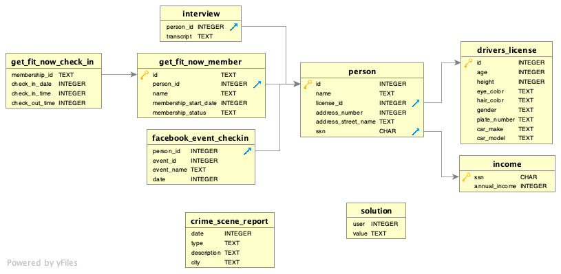

## **SQL Murder Mystery Game##
from [Knight Lab](https://mystery.knightlab.com/)

**Warning: Game Spoilers Ahead**

# *First, study the schema*
-Pay special attention to where the data of a column leaves table A (blue arrow) to join table B (gold key). You'll need to reference the schema often to keep track of table joins.



START
*We're investigating a murder, so let's start at the crime_scene_report*

```
SELECT *
FROM crime_scene_report
```

-*Notice the city locations. One of them is 'SQL City'. That's probably the spot for a SQL murder, right?*
-Search by type 'murder' so you don't find other crimes
```
SELECT *
FROM crime_scene_report
WHERE type = 'murder'
AND city = 'SQL City';
```

Out of the three records in the data output, one of the interview descriptions looks the most promising

| date | type | description | city |
|----------|----------|----------|---------|
| 20180115 |murder  | Security footage shows that there were 2 witnesses. The first witness lives at the last house on "Northwestern Dr". The second witness, named Annabel, lives somewhere on "Franklin Ave".  | SQL City |


-Using the addresses of each witness, we can search for their names and ids.

-First Witness Information: Last house on Northwestern Dr.
  -There are a lot of houses on that street name so we search by the last address number.
```
SELECT *
FROM person
WHERE address_street_name = 'Northwestern Dr'
ORDER BY address_number DESC
LIMIT 1;
```
| id	name | license_id	| address_number |	address_street_name	| ssn|
|----------|------------|----------------|----------------------| -------|
|14887|	Morty Schapiro | 118009	| 4919 | Northwestern Dr	| 111564949|

-Find Second Witness Information
  -Lives on Franklin Ave and her name is Annabel.
```
SELECT *
FROM person
WHERE address_street_name = 'Franklin Ave'
AND name LIKE '%Annabel%';
```

| id	| name | license_id |	address_number | address_street_name | ssn |
|-----|-----|------|-----------|-----------|------------|
|16371	| Annabel Miller	| 490173 | 	103	Franklin Ave | 318771143 |

-Now we can look up the interviews for these two witnessess, Annabel and Morty

```
SELECT *
FROM interview
WHERE person_id = 16371 OR person_id = 14887
```
-Note: I added a name column to the interview table so we can remember who is giving information.

| name | person_id | transcript |
|-------|----------|-----------|
|Morty | 14887 | I heard a gunshot and then saw a man run out. He had a "Get Fit Now Gym" bag. The membership number on the bag started with "48Z". Only gold members have those bags. The man got into a car with a plate that included "H42W". |
| Annabel | 16371 |	I saw the murder happen, and I recognized the killer from my gym when I was working out last week on January the 9th.|

-What people were working out on at the gym January 9th at the same time as Annabel?
```
SELECT *
FROM get_fit_now_check_in
WHERE check_in_date LIKE '%20180109%'
AND membership_id LIKE '%48Z%'
```
 
| membership_id	| check_in_date	| check_in_time	| check_out_time |
|--------------|---------------|---------------|----------|
| 48Z7A	| 20180109	| 1600	| 1730 |
| 48Z55	| 20180109	| 1530	| 1700 |

-We need to narrow down Annabel's workout time  so we can cross reference to other gym users at the same time. 

- We can start by using Annabel's person_id number (16371) to find her gym membership id number
```
SELECT *
FROM get_fit_now_member
WHERE person_id = 16371
```
|  id	| person_id	| name | membership_start_date | membership_status |
|---------|-------|-------|----------|-----------|
| 90081 |	16371	| Annabel Miller	| 20160208	 | gold |

-Annabel's get_fit_now id number (90081 ) 

-Find Annabel's workout time
```
SELECT *
FROM get_fit_now_check_in
WHERE membership_id = '90081'
```
| membership_id	| check_in_date	| check_in_time	| check_out_time|
|--------|----------|-----------|----------|
| 90081	| 20180109 |	1600	| 1700 |

-Annabel worked out on January 9th, from 4pm to 5 pm.

-Who at the gym has a gold membership of "48Z" on their member number AND worked out at an overlapping time?
  
| membership_id	| check_in_date	| check_in_time	| check_out_time |
|------------|------|-------|------|
| 48Z7A	| 20180109	| 1600	| 1730 |
| 48Z55	| 20180109	|1530	| 1700 |
  
-Do either of these people have a license plate that include "H42W"?
```
SELECT *
FROM get_fit_now_member
WHERE id = '48Z7A' OR id = '48Z55'
```

| id |	person_id	| name | membership_start_date | membership_status |
|------|-------|-------|------|----|
| 48Z55	| 67318	| Jeremy Bowers	| 20160101 |	gold |
| 48Z7A	| 28819 |	Joe Germuska	| 20160305 |	gold|

-Using the person table, we can find their license_id
```
SELECT *
FROM person
WHERE id = 28819 OR id = 67318
```
| id	| name	| license_id |	address_number	| address_street_name |	ssn |
|------|--------|-------|----|-----|----|
| 28819	| Joe Germuska|	173289 |	111 |	Fisk Rd	| 138909730 |
| 67318 |	Jeremy Bowers |	423327 |	530 |	Washington Pl, Apt 3A |	871539279|

-Using the license_id column, we can search the driver_license table to look at their license plate
```
SELECT *
FROM drivers_license
WHERE id = '173289' OR id = '423327'
```
id	age	height	eye_color	hair_color	gender	plate_number	car_make	car_model
423327	30	70	brown	brown	male	0H42W2	Chevrolet	Spark LS

-only one entry! And the plate matches the "H42W" description! We're onto something.

#Let's check Jeremy Bower's interview transcript
SELECT *
FROM interview
WHERE person_id = 67318

Output: 
person_id	transcript
67318	I was hired by a woman with a lot of money. I don't know her name but I know she's around 5'5" (65") or 5'7" (67"). She has red hair and she drives a Tesla Model S. I know that she attended the SQL Symphony Concert 3 times in December 2017.

# Find the red-headed, Tesla driving woman
SELECT *
FROM drivers_license
WHERE hair_color = 'red'
AND car_make = 'Tesla'
AND car_model = 'Model S'
AND gender = 'female'

Output: 
id	age	height	eye_color	hair_color	gender	plate_number	car_make	car_model
202298	68	66	green	red	female	500123	Tesla	Model S
291182	65	66	blue	red	female	08CM64	Tesla	Model S
918773	48	65	black	red	female	917UU3	Tesla	Model S


  
#Find their names. Cross reference their id/person_id with events (SQL Symphony) in facebook_event_checkin
SELECT *
FROM person
WHERE license_id = '291182' OR license_id = '202298' OR license_id = '918773'

Output:
id	name	license_id	address_number	address_street_name	ssn
78881	Red Korb	918773	107	Camerata Dr	961388910
90700	Regina George	291182	332	Maple Ave	337169072
99716	Miranda Priestly	202298	1883	Golden Ave	987756388

SELECT *
FROM facebook_event_checkin
WHERE person_id = 78881 OR person_id = 90700 OR person_id = 99716

Output: 
  person_id	event_id	event_name	date
99716	1143	SQL Symphony Concert	20171206
99716	1143	SQL Symphony Concert	20171212
99716	1143	SQL Symphony Concert	20171229

-Oh isn't that interesting! One person went to three SQL Symphony concerts, just like her hitman said she did. And that person is....
SELECT *
FROM person
WHERE id = 99716

Enter the solution (name) in the [solution box] (https://mystery.knightlab.com/)

Thanks for playing along with me! :)
